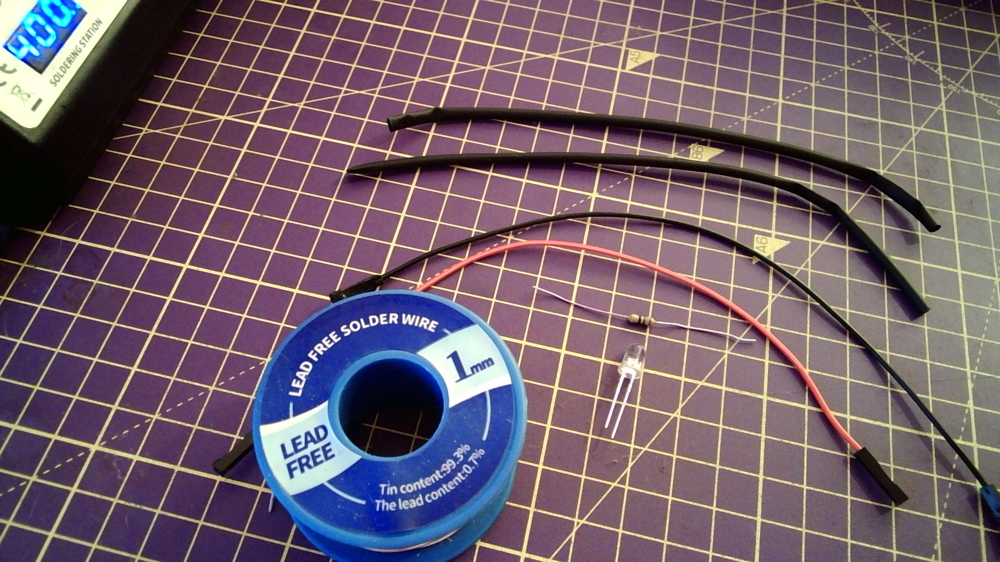

## لحام أسلاك LED والمقاومة والتوصيلات

- ستحتاج إلى متصل LED، ومقاومة (70 أوم أو أكثر)، وسلكين للتوصيل مع مقابس وأنابيب شرنك حراري (وهي عبارة عن أنابيب بلاستيكية تتقلص بالحرارة لحماية الاسلاك).

- قم بتسخين كل من قطبي المتصل LED لبضع ثوان ثم قم بتطبيق اللحام بالتساوي لتثبيته، وكرر العملية للقطب الآخر.

- قم بتسخين إحدى قطبي المقاومة لبضع ثوان ثم قم بتطبيق اللحام بالتساوي على القصدير، وكرر الأمر مع القطب الآخر.

- قم بمحاذاة قطب المتصل المضيء مع قطب المقاومة ثم استخدم الحرارة حتى يتماسك الاثنان.

- قم بتجريد اثنين من سلاك التوصيل بحيث يكون لكل منهما نهاية واحدة ذات مقبس.

- قم بتلحيم سلكي التوصيل بالقصدير.

- ضع أنبوب الشرنك الحراري على طرفي أسلاك التوصيل.

- إثنِ أحد قطبي المقاومة حول القطب الأحمر للمتصل المضيء LED.

- حرك أنبوب الشرنك الحراري فوق الوصلات الملحومة.

- استخدم الحافة العريضة لكاوي اللحام لتسخين الأنبوب حتى يتم إحكام ربطه حول الوصلات وأسلاك التوصيل.

- اختبر المتصل المضيء LED باستخدام قطبي 3V3 و GND.

