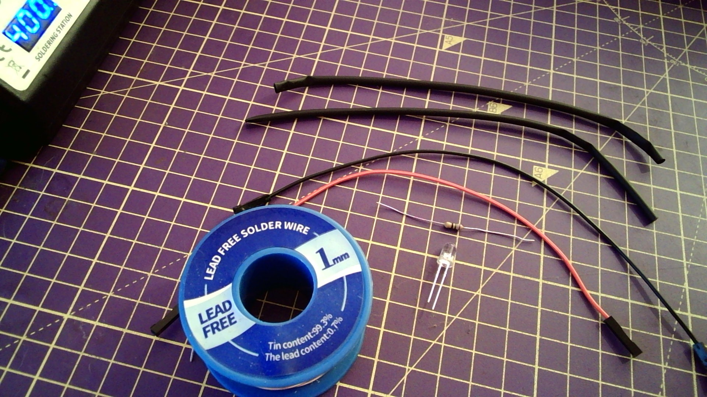

## Souder une LED, une résistance et des fils de connexion

- Tu auras besoin d'une LED, d'une résistance (70 ohms ou plus), de deux câbles avec prises et d'une gaine thermorétractable.

- Chauffe une des deux pattes de la LED pendant quelques secondes, puis applique uniformément de la soudure pour l'étamer et répète pour l'autre patte.

- Chauffe une des deux pattes de la résistance pendant quelques secondes, puis applique uniformément de la soudure pour l'étamer et répète pour l'autre patte.

- Aligne une patte de la LED avec une patte de la résistance puis applique de la chaleur jusqu'à ce que les deux se soudent ensemble.

- Dénude deux câbles de façon à ce que chacun ait une seule extrémité avec une prise.

- Étame les deux fils dénudés.

- Place la gaine thermorétractable sur les deux câbles.

- Soude le fil à la résistance et à l'autre branche de la LED.

- Fais glisser la gaine thermorétractable sur les soudures.

- Utilise le bord large du fer à souder pour chauffer la gaine jusqu'à ce qu'elle soit bien serrée autour des soudures et des câbles.

- Teste la LED à l'aide de la broche 3V3 et prise GND.

