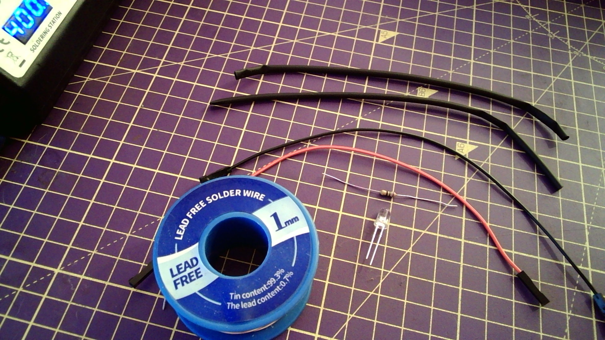

## Soldering an LED, resistor and jumper wires

- You will need an LED, a resistor (70 ohm or greater), two jumper leads with sockets and heatsrhink tubing.

- Heat both one of the legs of the LED for a few seconds and then evenly apply solder to tin it, and repeat for the other leg.

- Heat both one of the legs of the resistor for a few seconds and then evenly apply solder to tin it, and repeat for the other leg.

- Align a leg of the LED with a leg of the resistor then apply heat until the two of them bond.

- Strip two jumper leads so each has a single socketed end.

- Tin both jumper leads.

- Place heatshrink tubing over both jumper leads.

- Bond the jumper leads to the resistor and the other leg of the LED.

- Slide the heatshrink tubing over the soldered joins.

- Use the wide edge of the soldering iron to heat the tubing until it is tight around the joins and the jumper leads.

- Test the LED using a 3V3 and GND pin.

